# 💱 Конвертер валют с поддержкой Steam конвертаций

> [!note]
> Простой и удобный десктопный конвертер валют для Windows, позволяющий переводить суммы между украинской гривной (UAH) и российским рублем (RUB). Программа имеет как графический (GUI), так и консольный (CLI) интерфейс
>
> Главной особенностью является встроенный калькулятор для пополнения кошелька Steam, который учитывает комиссию сервиса и позволяет рассчитать итоговую сумму зачисления как из гривен, так и из рублей

> [!warning]
> Исполняемые файлы (`.exe`) были созданы с помощью компилятора **Nuitka**. Некоторые антивирусы (включая Защитник Windows) могут ошибочно помечать такие файлы как потенциально опасные. Это нормальное поведение для упакованных Python приложений без цифровой подписи **Это ложное срабатывание.** При необходимости добавьте файл в исключения антивируса или скомпилируйте исходный код самостоятельно

<div align="center" style="text-align: center;">
  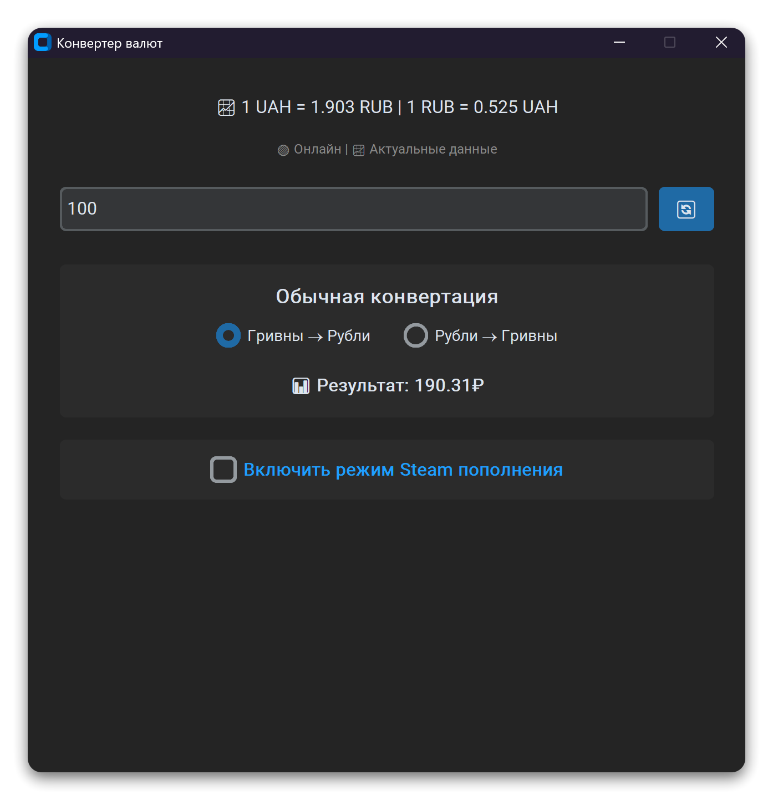
  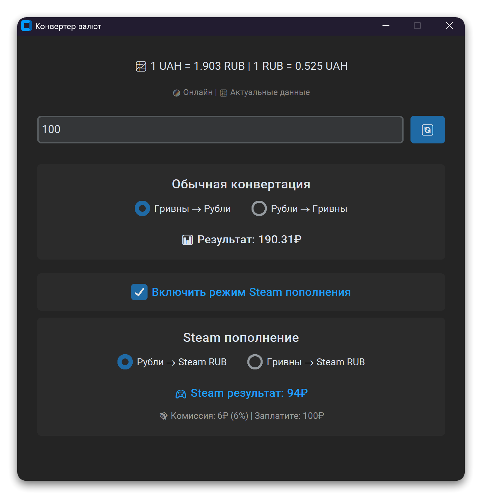
</div>

## 🚀 Основные возможности

- **💱 Двусторонняя конвертация**: UAH → RUB и RUB → UAH по актуальному курсу ЦБ РФ
- **2️⃣ Два режима работы:** Полноценный графический интерфейс (GUI) и утилита командной строки (CLI).
- **🎮 Режим Steam пополнения**: Расчет реального количества Steam RUB с учетом комиссии plati.market
- **📈 Актуальные курсы**: Автоматическое получение курсов валют с API Центрального Банка РФ
- **💾 Умное кэширование**: Кэширование курсов валют и данных Steam для быстрой работы
- **🌙 Темный интерфейс**: Современный дизайн с темной темой на базе CustomTkinter
- **⌨️ Консольный режим**: Возможность работы через командную строку без GUI
- **🛡️ Fallback система**: Резервные данные при недоступности API
- **✍️ Ручной ввод курса:** Возможность указать собственный курс валют, если автоматическое получение невозможно или не требуется
- **🚩 Поддержка аргументов запуска:** Возможность передать сумму и флаги прямо при запуске `.exe` файла

## 📦 Установка и запуск

### 🖥️ Готовые .exe файлы (рекомендуется)

Вы можете скачать уже скомпилированные `.exe` файлы со страницы **[Releases](https://github.com/WhoSowSee/CurrencyConverter/releases)**

- `converterGUI.exe` - версия с графическим интерфейсом
- `converterCLI.exe` - консольная версия

### ⚙️ Запуск из исходного кода

### Зависимости

- `customtkinter` - современный GUI фреймворк
- `requests` - HTTP запросы к API

#### 1. Установите Python 3 (3.13+)

#### 2. Клонируйте репозиторий:

```bash
#HTTP
git clone https://github.com/WhoSowSee/CurrencyConverter.git

#SSH
git clone git@github.com:WhoSowSee/CurrencyConverter.git

cd currencyconverter
```

#### 3. Создайте и активируйте виртуальное окружение (рекомендуется):

```pwsh
#С помощью venv
python -m venv .venv
.\.venv\Scripts\activate

#С помощью uv
uv venv .venv
.\.venv\Scripts\activate
```

#### 4. Установите зависимости:

```pwsh
# C помощью pip и requirements.txt
pip install -r requirements.txt

#C помощью uv и requirements.txt
uv pip install -r requirements.txt

#C помощью uv и pyproject.toml
uv sync
```

#### 5. Запустите приложение:

```pwsh
python gui.py  #GUI
python cli.py  #CLI
```

## 🖥️ Использование

### 🪟 Графический интерфейс (GUI)

1. **Запуск приложения**: Запустите `converterGUI.exe` или `python gui.py`.
2. **Ввод суммы**: Введите сумму в поле ввода (поддержка Ctrl+A для выделения всего текста)
3. **Выбор режима конвертации**:
   - "Гривны → Рубли" (UAH → RUB)
   - "Рубли → Гривны" (RUB → UAH)
4. **Steam режим**: Включите чекбокс "Включить режим Steam пополнения" для расчета реального количества Steam RUB с учетом комиссии
5. **Обновление курса**: Нажмите кнопку 🔄 для принудительного обновления курса валют

При запуске GUI можно использовать флаги для предустановки значений:

- `converterGUI.exe 100` — запустить с суммой 100
- `converterGUI.exe -r` — установить режим конвертации RUB → UAH
- `converterGUI.exe -s` — включить режим Steam (RUB → Steam)
- `converterGUI.exe -sr` — включить режим Steam (UAH → Steam)
- `converterGUI.exe -m` — запустить с запросом ручного ввода курса

<div align="center" style="text-align: center;">
  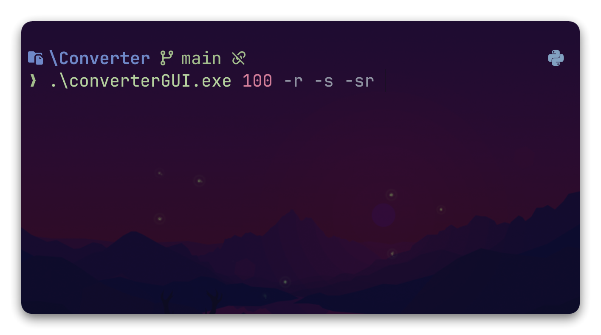
  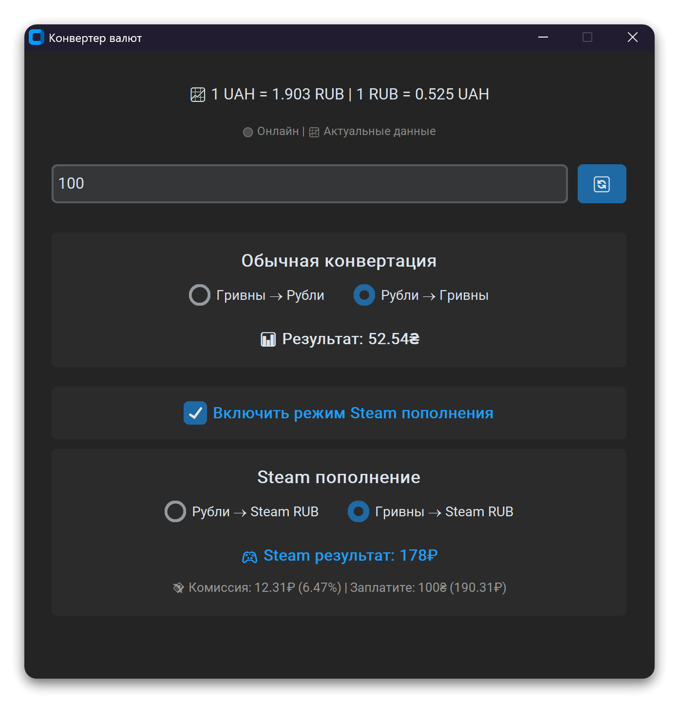
</div>

---

<div align="center" style="text-align: center;">
  
  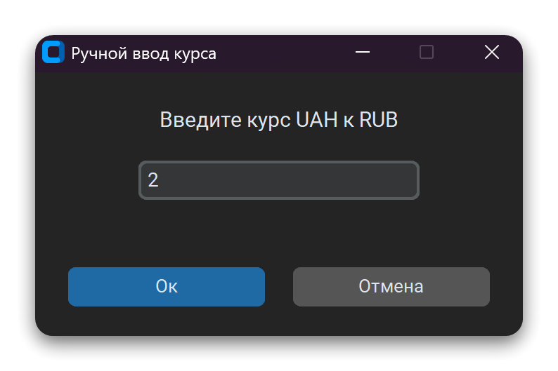
  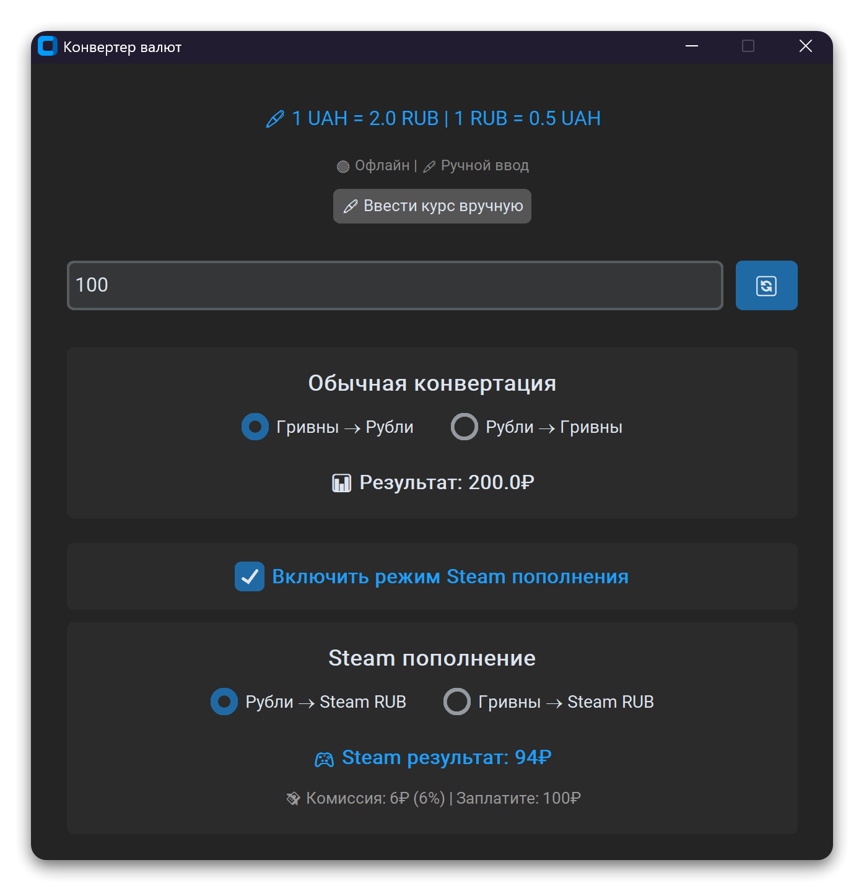
</div>

### ⌨️ Консольный режим (CLI)

Консольная утилита предоставляет быстрый способ конвертации без графического интерфейса. Вы можете посмотреть все опции, выполнив `converterCLI.exe --help`.

```pwsh
# Основные команды
.\converterCLI.exe              # Интерактивный режим
.\converterCLI.exe 100          # Конвертировать 100 UAH в RUB
.\converterCLI.exe 100 -r       # Конвертировать 100 RUB в UAH
.\converterCLI.exe 100 -s       # Расчет Steam для 100 RUB
.\converterCLI.exe 100 -sr      # Расчет Steam для 100 UAH
```

#### Параметры командрой строки (CLI)

| Параметр               | Описание                                    |
| ---------------------- | ------------------------------------------- |
| `-r, --reverse`        | Конвертация RUB → UAH                       |
| `-s, --steam`          | Расчет Steam комиссии (исходная валюта RUB) |
| `-sr, --steam-reverse` | Расчет Steam комиссии (исходная валюта UAH) |
| `-m, --manual-rate`    | Ручной ввод курса валют                     |
| `-h, --help`           | Показать справку                            |

#### Примеры использования CLI

```pwsh
# Конвертировать 100 UAH в RUB с расчетом Steam
.\converterCLI.exe 100 -sr

# Установить курс вручную
.\converterCLI.exe -m 2.5 100

# Запросить ручной ввод курса
.\converterCLI.exe 100 -m

# Обратная конвертация
.\converterCLI.exe 500 -r
```

<div align="center" style="text-align: center;">
  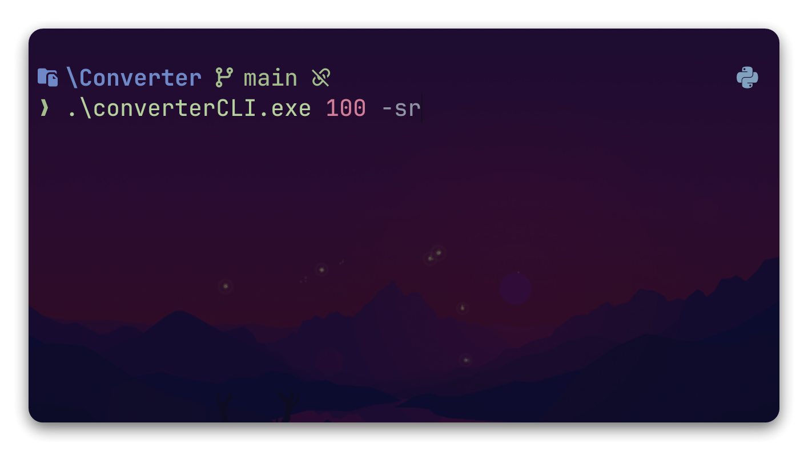
  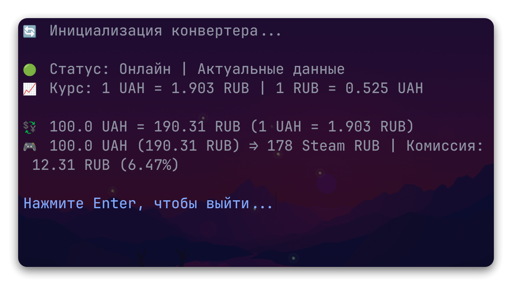
</div>

<div align="center" style="text-align: center;">
  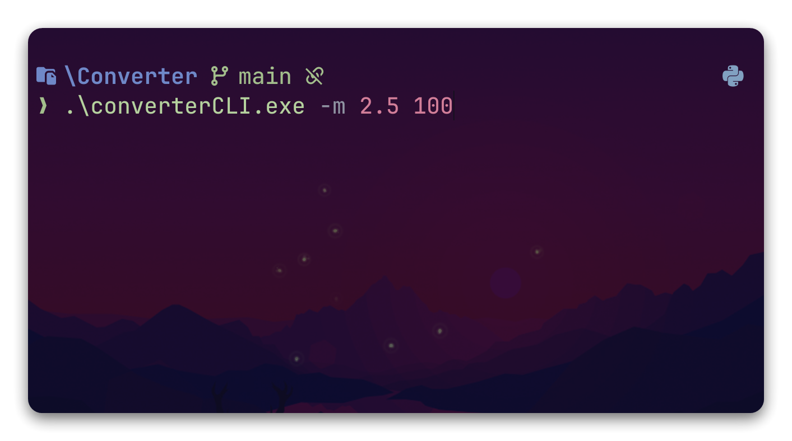
  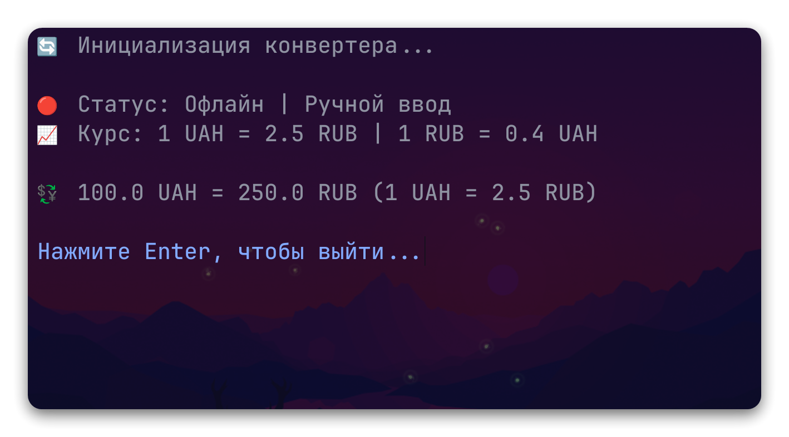
</div>

## 🔧 Архитектура проекта

```
├── core.py              # Основная логика конвертера
├── gui.py               # Графический интерфейс
├── cli.py               # Консольный интерфейс
├── currency_cache.json  # Файл кэша
├── requirements.txt     # Зависимости
├── pyproject.toml       # Конфигурация проекта
└── uv.lock              # Конфигурация зависимостей
```

### 🧩 Основные компоненты

- **CurrencyConverterCore** - центральный класс с логикой конвертации
- **APIClient** - получение данных от внешних API
- **CacheManager** - управление кэшем курсов валют
- **SteamCalculator** - расчет комиссий Steam
- **NetworkChecker** - проверка доступности интернета

## 🔧 Технические детали

### 📊 Источники данных

- **📈 Курс валют**: [API ЦБ РФ](https://www.cbr-xml-daily.ru/daily_json.js)
- **🎮 Steam комиссии**: API Plati.market (недокументированный)
- **💾 Fallback данные**: Встроенная таблица комиссий для 18 популярных сумм

<div align="center" style="text-align: center;">
  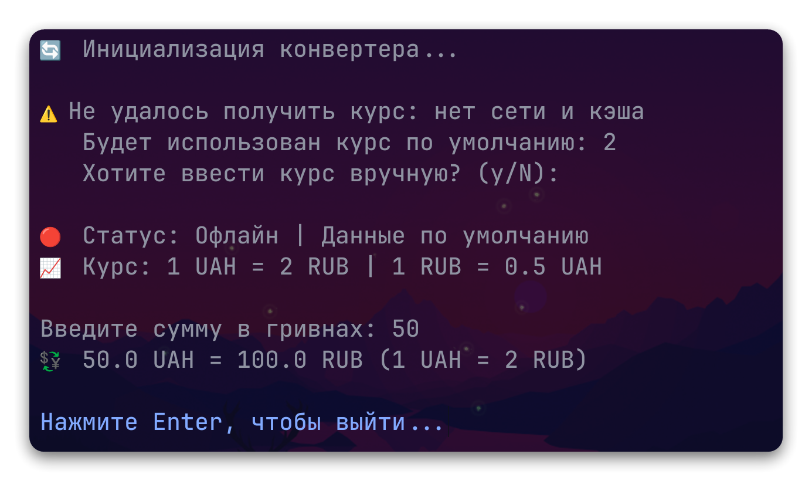
  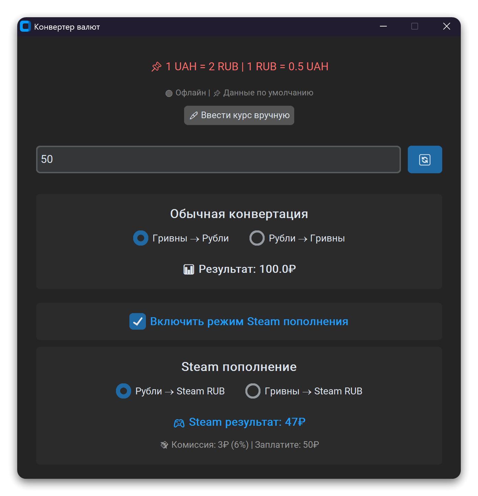
</div>

### 💾 Кэширование

**Приложение автоматически сохраняет данные в `currency_cache.json`:**

- **📈 Курсы валют**: действительны 10 минут онлайн, 24 часа офлайн
- **🎮 Данные Steam**: действительны 3 минуты
- **⌛Временные метки для валидации данных**

<!-- <div style="display: flex; justify-content: center; align-items: center; gap: 15px;">
  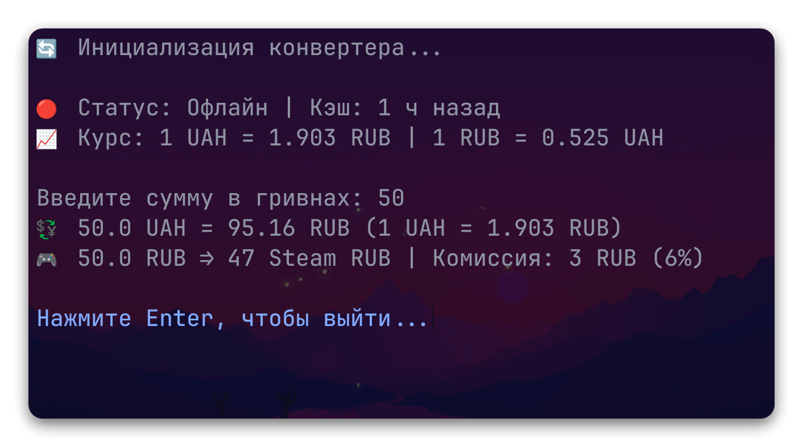
  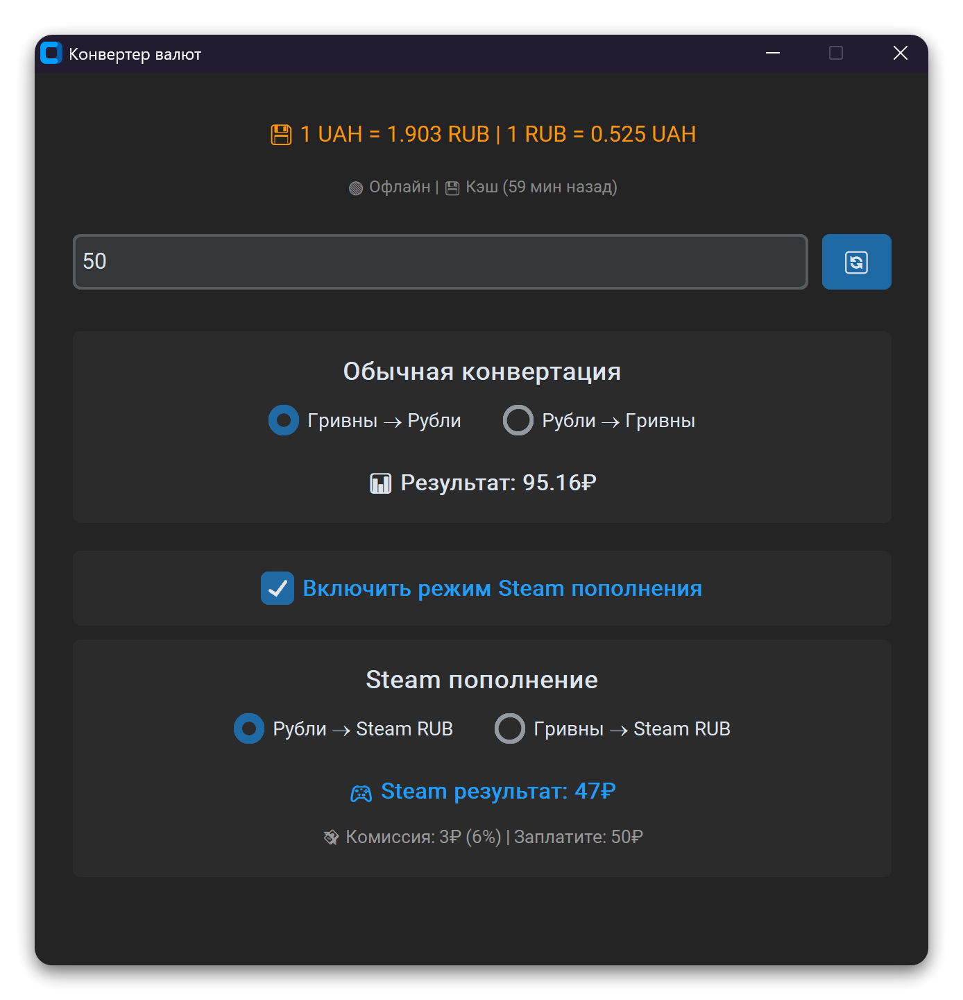
</div> -->

<div align="center" style="text-align: center;">
  
  
</div>

### 🎮 Steam режим

**Специальный режим для расчета реальной суммы пополнения Steam с учетом комиссий:**

- **💱 Поддержка конвертации из UAH и RUB**
- **💸 Точный расчет комиссий через API**
- **💾 Fallback расчет при отсутствии интернета**
- **💰 Отображение итоговой суммы к доплате**

#### 💽 Алгоритм fallback расчета Steam

При недоступности API используется встроенный алгоритм:

- Точные данные для популярных сумм (30₽ - 15000₽)
- Интерполяция между известными точками
- Экстраполяция для сумм вне диапазона
- Средняя комиссия ~6.5% для больших сумм

## 🔨 Сборка проекта

#### Для самостоятельной сборки в `.exe` с помощью Nuitka:

**Версия с графическим интерфейсом (GUI):**

```pwsh
nuitka --standalone --onefile --windows-console-mode=disable --enable-plugin=tk-inter --include-package=customtkinter --include-package=requests --windows-icon-from-ico=icon.ico --product-name="Currency Converter With GUI" --no-deployment-flag=self-execution --output-filename=converterGUI.exe .\gui.py
```

**Верcия без графического интерфейса (CLI):**

```pwsh
nuitka --standalone --onefile --enable-plugin=tk-inter --include-package=customtkinter --include-package=requests --windows-icon-from-ico=icon.ico --product-name="Currency Converter In Console" --no-deployment-flag=self-execution --output-filename=converterCLI.exe .\cli.py
```

## 💻 Используемые технологии

- **🐍 Python 3**: Основной язык программирования
- **🎨 CustomTkinter**: Современный GUI фреймворк с темной темой
- **🌐 Requests**: Библиотека для HTTP-запросов к API
- **⚡ Nuitka**: Компилятор Python в машинный код для создания .exe
- **🏗️ Threading**: Асинхронные запросы для отзывчивого интерфейса
- **💾 LRU Cache**: Оптимизация производительности расчетов

<a target="_blank" href="https://icons8.com/icon/yspA2KkFHo2i/money-circulation">Money Circulation</a> иконка от <a target="_blank" href="https://icons8.com">Icons8</a>
